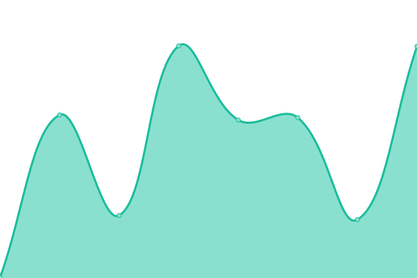

# [📈 Live Status](https://maxysoft.github.io/taco-status): <!--live status--> **🟩 All systems operational**

This repository contains the open-source uptime monitor and status page for [Tomas](https://maxysoft.github.io/taco-status), powered by [Upptime](https://github.com/upptime/upptime).

With [Upptime](https://upptime.js.org), you can get your own unlimited and free uptime monitor and status page, powered entirely by a GitHub repository. We use [Issues](https://github.com/maxysoft/taco-status/issues) as incident reports, [Actions](https://github.com/maxysoft/taco-status/actions) as uptime monitors, and [Pages](https://maxysoft.github.io/taco-status) for the status page.

<!--start: status pages-->
<!-- This summary is generated by Upptime (https://github.com/upptime/upptime) -->
<!-- Do not edit this manually, your changes will be overwritten -->
<!-- prettier-ignore -->
| URL | Status | History | Response Time | Uptime |
| --- | ------ | ------- | ------------- | ------ |
|  [WAX RPC API](https://api-wax.tacocrypto.io/v1/chain/get_info) | 🟩 Up | [wax-rpc-api.yml](https://github.com/maxysoft/taco-status/commits/HEAD/history/wax-rpc-api.yml) | 

 525ms
     
 | 

<a href="https://maxysoft.github.io/taco-status/history/wax-rpc-api">100.00%</a>
    

|  [Hyperion](https://api-wax.tacocrypto.io/hyperion/v2/health) | 🟩 Up | [hyperion.yml](https://github.com/maxysoft/taco-status/commits/HEAD/history/hyperion.yml) | 

 211ms
     
 | 

<a href="https://maxysoft.github.io/taco-status/history/hyperion">100.00%</a>
    

|  [Atomic](https://atomic-wax.tacocrypto.io/health) | 🟩 Up | [atomic.yml](https://github.com/maxysoft/taco-status/commits/HEAD/history/atomic.yml) | 

 474ms
     
 | 

<a href="https://maxysoft.github.io/taco-status/history/atomic">100.00%</a>
    

<!--end: status pages-->

[**Visit our status website →**](https://maxysoft.github.io/taco-status)

## 📄 License

- Powered by: [Upptime](https://github.com/upptime/upptime)
- Code: [MIT](./LICENSE) © [Anand Chowdhary](https://anandchowdhary.com), supported by [Pabio](https://pabio.com)
- Data in the `./history` directory: [Open Database License](https://opendatacommons.org/licenses/odbl/1-0/)
